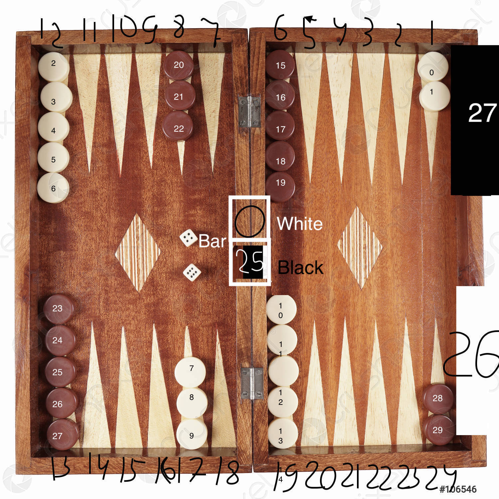

# BACKGAMMON
### Technical Design Assignment

#### interface methods description

```
/***
*
* @return Color.BLACK or Color.WHITE representing the first player
*/
  
Color start();
```

```
/***
*
* @return Dice object in form {"int:points","bool:if_double","first_dice:int", "second_dice:int"}
*/

Dice dice();
```

```
/***
*
* @param stone id (see below in mapping section) of wished stone to move
* @param position id (see below in mapping section) of position to move
* @return 0 if ok. throws Exception.
*/

boolean set(int stone, int position) throws NotEnoughPointsException, WrongPositionException, WrongStonePickedException;

```

```
/***
* stop the game
*/

void give_up();
```

#### field mapping




